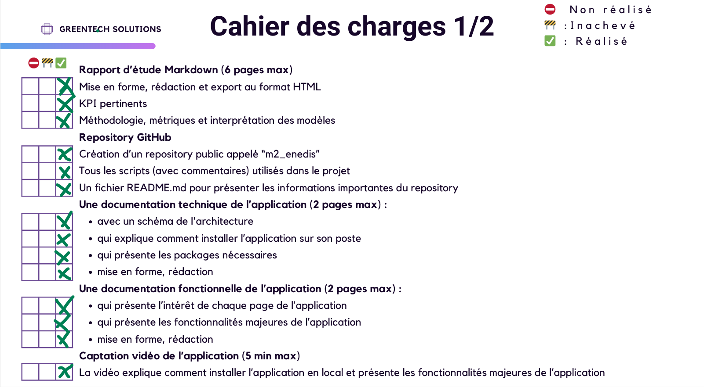
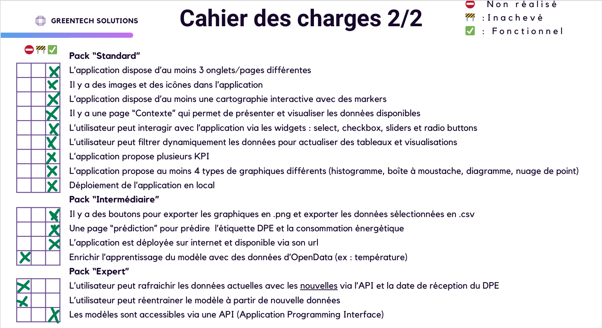

# Performance Énergétique

## Présentation
Ce projet a été initié dans le cadre du cours de Python et Machine Learning en Master 2 à l'Université Lumière Lyon 2, et réalisé par les étudiants pour analyser et prédire la performance énergétique des bâtiments.

L'application est disponible en ligne à l'adresse suivante : [https://performanceenergetiquea.streamlit.app/](https://performanceenergetiquea.streamlit.app/)

Lien vidéo: https://youtu.be/2YLq5j4raHU

Ce projet a été réalisé par les étudiants suivants :
- **ADJARO PATOUSSI Edina**  
  *Email:* e.adjaro-patoussi@univ-lyon2.fr
- **KARAMOKO Awa**  
  *Email:* awa.karamoko@univ-lyon2.fr
- **RANDRIAMIARIJAONA Herinantenainasoa (Nancy)**  
  *Email:* herinantenainasoa.randriamiarijaona@univ-lyon2.fr

## Installation de l'application

### 1. Cloner le projet :  
Cloner le dépôt GitHub en utilisant la commande suivante :
```bash
git clone https://github.com/Adjaro/Performance_Energetique.git
```

### 2. Créer un environnement virtuel :  
Créez un environnement virtuel pour isoler vos dépendances :
```bash
python -m venv nom_de_votre_environnement
```
Ensuite, activez l'environnement virtuel :
```bash
nom_de_votre_environnement\Scripts\activate.bat  # Pour Windows
```
Ou sur macOS/Linux :
```bash
source nom_de_votre_environnement/bin/activate
```

### 3. Installation des librairies  
Installez les librairies nécessaires en exécutant la commande suivante :
```bash
pip install -r requirements.txt
```

### 4. Lancer l'API  
Démarrez l'API en suivant les instructions dans le dossier API (si applicable) pour permettre la communication entre les composants du projet.
```bash
python app.py
```

### 5. Lancer l'application  
Exécutez l'application Streamlit avec la commande suivante :
```bash
streamlit run app.py
```

## Présentation des répertoires

- **data** : Contient les données utilisées pour le projet.
- **interface** : Contient les fichiers de l'interface utilisateur.
- **modele** : Contient les fichiers du modèle utilisé pour les prédictions.
- **notebooks** : Contient les notebooks Jupyter utilisés pour l'exploration des données et la création des modèles.

## Liste des tâches réalisées

 
 

 
